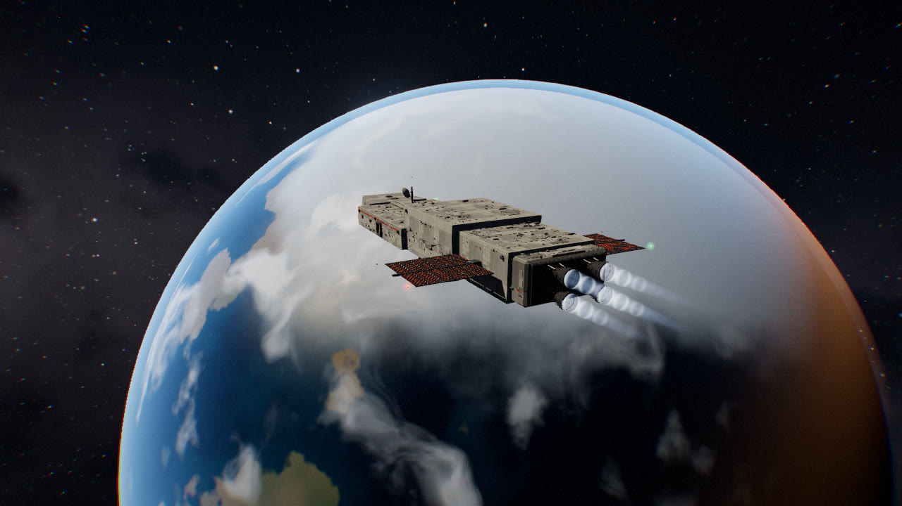
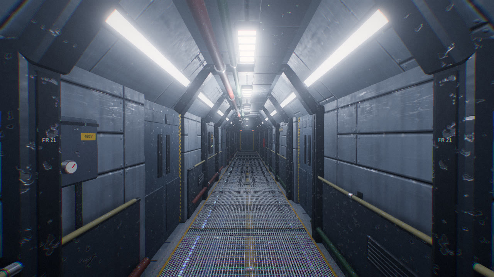
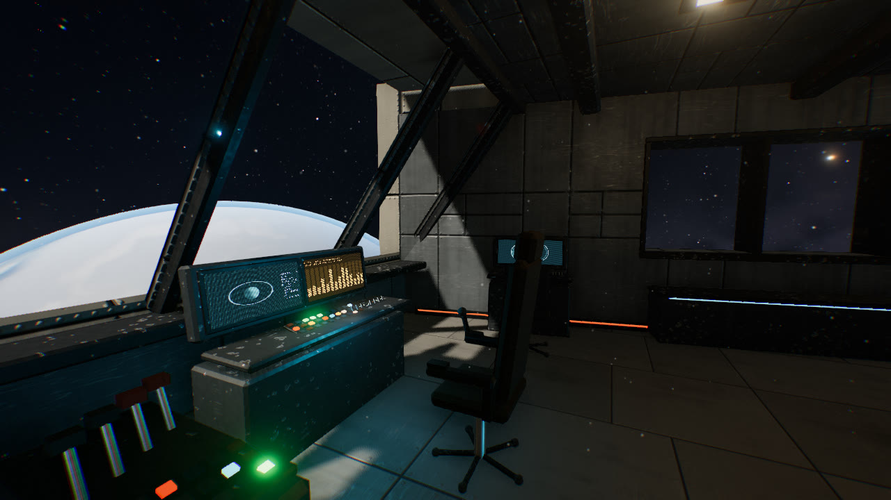
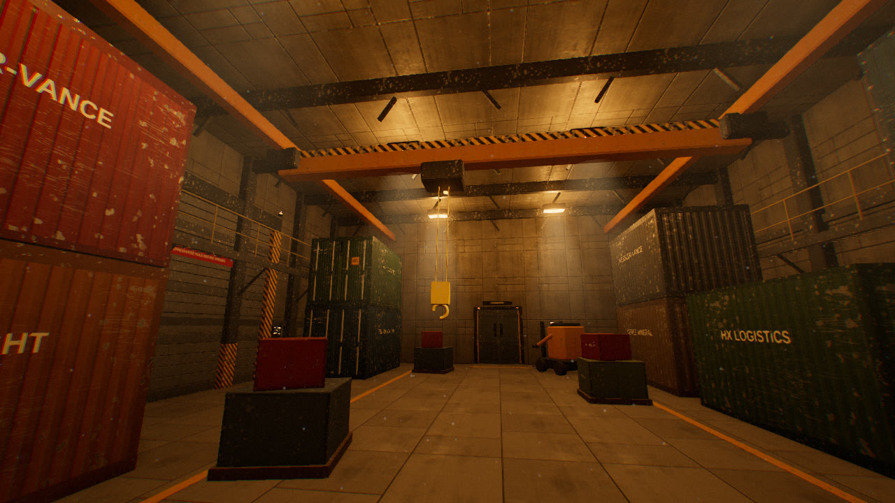
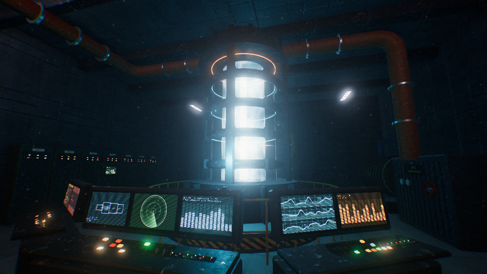

# Perihelion

A walkable, procedurally modeled industrial spaceship that runs in the browser.
You can board CSV *Perihelion*, an 82 m deep-space ore hauler, and walk through it in first person: the bridge, main corridor, crew quarters, airlock, galley, medbay, life support, a 7 m-tall cargo bay and the reactor room. You can also watch the same walkthrough as a cinematic tour.

There are no model files. Every surface, texture and effect is generated at load time from code: TypeScript for the geometry, GLSL for the shaders. It is built on [Three.js](https://threejs.org) and WebGL 2.



**Walkthrough video:** [`media/perihelion-walkthrough.mp4`](media/perihelion-walkthrough.mp4), 1080p. It was rendered from the app's own tour mode.

| | |
|---|---|
|  |  |
|  |  |

## Quick start

```bash
npm install
npm run dev        # http://localhost:5173
npm run build      # static build in dist/ (relative paths, host anywhere)
```

Choose **Board the ship** to walk, or **Cinematic tour** to watch.

| Input | Action |
|---|---|
| Mouse / drag | Look (click to capture the pointer) |
| WASD or arrows | Move |
| Shift | Sprint |
| C | Crouch |
| F | Flashlight |
| M | Deck map |
| T | Start or stop the tour |
| \` | Performance stats |
| Esc | Menu |

On touch screens, a joystick on the left moves you and dragging on the right looks around.

## What's on board

| Zone | Highlights |
|---|---|
| **Bridge** | Raked, mullioned forward window under a hull visor. Pilot stations with an overhead switch panel, a raised captain's dais, and a holo-table projecting an animated planet. |
| **Main corridor** | Octagonal rib frames, angled light panels, grated floor over lit service pipes, cable trays, signage, and one fixture that won't stop flickering. |
| **Airlock and EVA prep** | Four pressure suits on racks, a pressure-lock arch, rotating amber beacons, and an outer hatch that opens to space. |
| **Crew quarters** | Stacked privacy pods with reading lamps and half-drawn curtains, window desks, and a card game left on the table. |
| **Galley** | Kitchen run, mess tables with pendant lamps, and hydroponic planters under pink grow lights. |
| **Medbay** | Treatment beds with scanner arches, a vitals monitor and a stasis pod. |
| **Life support** | O₂/N₂ tank farm, CO₂ scrubbers with spinning fans, and water reclamation. |
| **Cargo bay** | Stacked corrugated containers, a gantry crane with a swaying hook, catwalks, a power loader, and sodium floodlights with volumetric beams. |
| **Engineering** | A fusion reactor column with a plasma shader, magnetic confinement rings, coolant loops, turbine generators and switchgear. |
| **Exterior** | Greebled hull plating, a four-bell drive with shock-diamond plumes, radiator wings, a comms mast and dish, nav lights and strobes. It orbits a procedural planet with clouds, oceans, city lights and an atmosphere. |

## How it's built

```text
src/
  app.ts               scene setup, sky/planet, sun shadows, reflection probes, frame update
  main.ts              UI, input modes, HUD, minimap, capture API for the video renderer
  tour.ts              cinematic camera script (used by the app and the video)
  engine/
    pipeline.ts        renderer, GTAO pre-pass, bloom, tone map + grade, SMAA/FXAA, quality presets
    batcher.ts         merges static geometry per (zone, material), with continuous box UVs
    lightPool.ts       fixed pool of point lights assigned to the most relevant fixtures
    zones.ts           rooms as zones, door-linked visibility (PVS), per-room ambience
  materials/
    texgen.ts          GPU texture forge: one MRT pass writes albedo, normal and ORM maps
    library.ts         PBR materials, patched for SSAO-on-indirect and paint-chip masking
    screens.ts         animated console displays (radar, graphs, terminals, vitals, etc.)
    fx.ts              reactor plasma, hologram, engine plume, volumetric beams, dust motes
    space.ts           baked HDR sky cubemap, planet and atmosphere, sun, star points
  ship/
    layout.ts          general arrangement: rooms, doors, windows, hull modules
    structure.ts       wall skins with door/window cutouts, floors, ceilings, hull shell
    rooms/*.ts         outfitting for each compartment
    exterior.ts        greeble scatter, engines, radiators, mast, lights, markings
    kit.ts / props.ts  modeling helpers and reusable props (consoles, lockers, pipes, etc.)
    doors.ts, signs.ts sliding pressure doors; canvas signage atlas
  player/              walking controller and 2D collision
scripts/
  render-video.mjs     deterministic headless render of the tour to MP4
  views.mjs            render arbitrary viewpoints to PNG against `npm run dev` (debugging)
```

### Rendering

- **Procedural PBR textures.** At startup, one fragment shader bakes 11 tileable texture sets straight into render targets. It uses multiple render targets (MRT) to write albedo, normal and ORM (occlusion, roughness, metalness) in a single pass. The sets include wall panels with bolts and vents, hull plating with rivets and micrometeorite pitting, bar grating, diamond tread plate, hazard stripes, corrugated steel, worn paint, fabric, rubber and brushed metal.
- **One material, many paints.** Pieces are tinted through vertex colors. A shader patch keeps worn and chipped (metallic) texels untinted, so bare steel shows through paint instead of reading as darker paint.
- **Ambient occlusion on indirect light only.** GTAO runs as a half-resolution pre-pass, and every PBR material samples it for ambient and reflected light. Emissive screens and direct highlights are never muddied by it.
- **Lighting.**
  - The ship has 150+ light fixtures, but only a pool of 6–12 point lights exists at any time. They are reassigned each frame to the fixtures that matter for the current view, and fade in and out so reassignment never pops or recompiles shaders.
  - The sun casts a 4096² shadow map. The ship is static, so it is rendered once, which lets sunlight fall through the bridge windows.
  - Each room gets a two-bounce reflection probe baked at load.
- **Space.** The star field, galactic band, dust lanes and nebula are baked once into an HDR cubemap. The planet is shaded live, and the sun is an HDR sprite that bloom turns into glare.
- **Post-processing.** Bloom, ACES tone mapping, split-tone grading, vignette, subtle chromatic aberration, film grain, then SMAA or FXAA.

### Efficiency

- About 6,800 modeled parts merge into ~118 meshes: one per zone and material.
- Zones render only when visible from the current room through open doors or windows.
- The ship totals about 227k triangles, and a typical interior frame draws roughly 90–250 calls, including post-processing.
- Quality presets (Low, Medium, High) scale resolution, AO, light count and shadows.
- Dynamic resolution backs off automatically when frame time exceeds budget.

## Rendering the video

The tour is deterministic (fixed timestep), so the video is rendered frame by frame in headless Chromium. A GPU is not required.

```bash
pip install imageio-ffmpeg          # or have ffmpeg on PATH
npm run render:video                # -> media/perihelion-walkthrough.mp4
npm run render:stills -- 5,30,62    # PNG stills at those seconds
node scripts/render-video.mjs --segment 0/3   # render in resumable parts, then --concat 3
```

On a machine without a GPU, SwiftShader takes a few seconds per 1080p frame. With a real GPU it is much faster.

## License

MIT. See [LICENSE](LICENSE).
